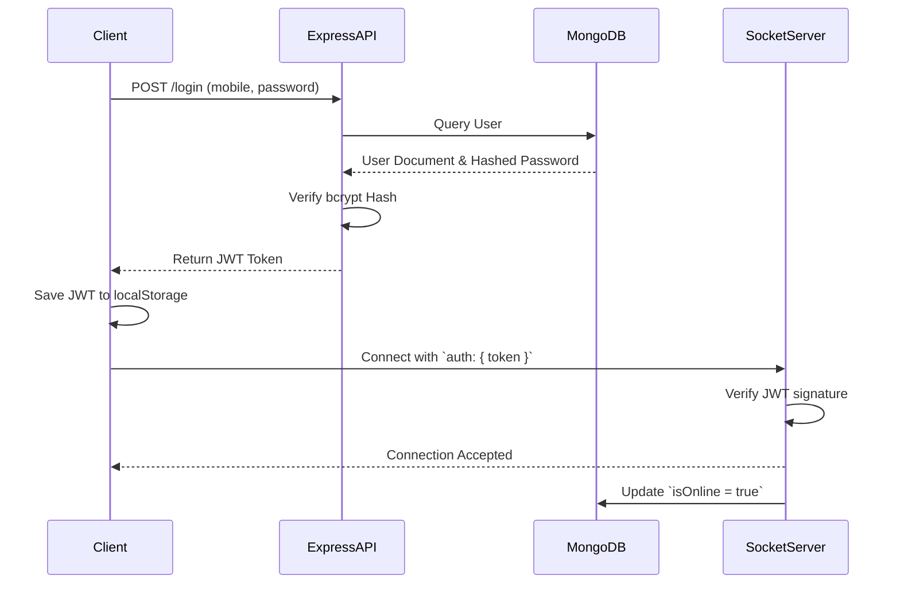
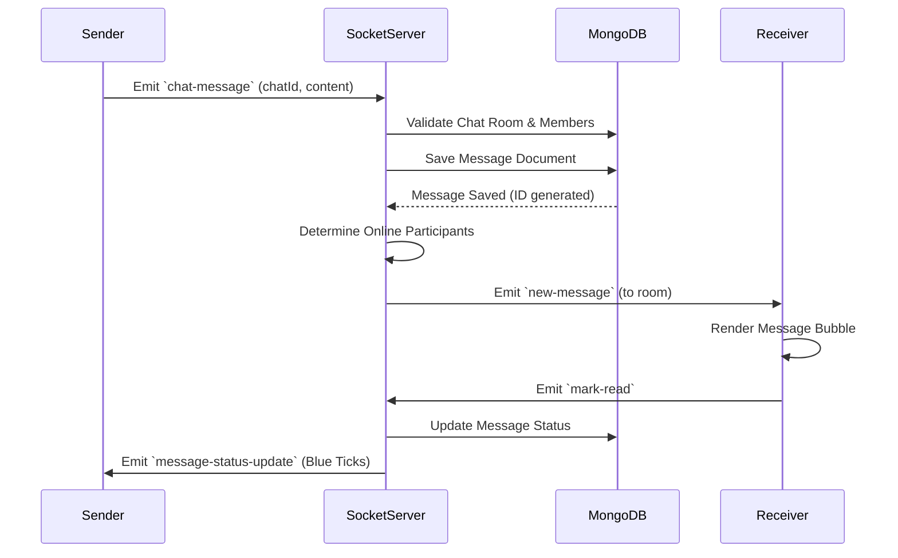
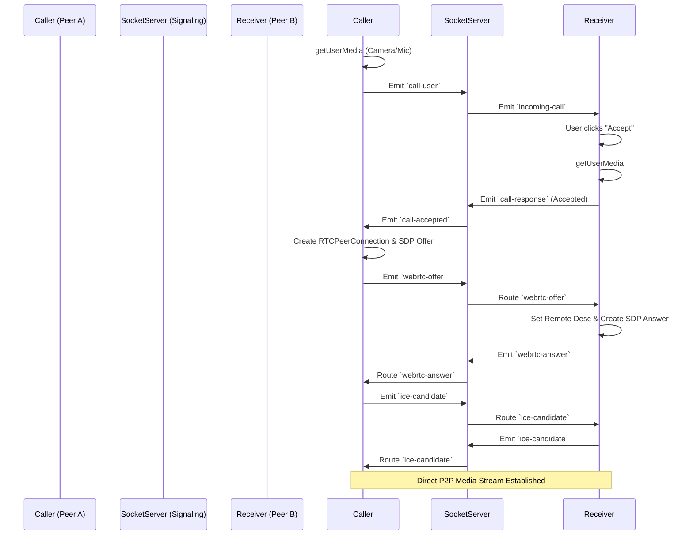

# AeroChat - Real-Time Chat Application

AeroChat is a full-featured, real-time chat application built with Node.js, Express, Socket.io, and MongoDB. It offers instant messaging, multimedia file sharing, user management, and seamless peer-to-peer audio and video calling through WebRTC.

## 🚀 Features

### Core Chat Functionality
- **Real-Time Messaging:** Powered by Socket.io for instantaneous communication.
- **Private & Group Chats:** Support for 1-on-1 private messaging and multi-user group chats.
- **Global Lounge:** A default public room where all users can chat together.
- **Message Status:** Real-time delivery and read receipts (single tick, double tick, blue tick).
- **Typing Indicators:** See when other users are currently typing.
- **Message Reactions:** React to messages instantly with a selection of emojis.
- **Delete Messages:** Ability to delete messages for yourself or for everyone in the chat.

### Media & File Sharing
- **Rich Media Support:** Seamlessly send images, videos, and documents.
- **Voice Notes:** Record and send audio messages directly within the chat.
- **Base64 Transfer:** Ultra-fast multimedia transmission via WebSockets (up to 5MB payload).

### Audio & Video Calling (WebRTC)
- **Peer-to-Peer Calls:** High-quality, low-latency audio and video calls.
- **Call Fallback:** Built-in animated dummy stream fallback for testing across local browser tabs without camera hardware locks.
- **In-Call Controls:** Mute audio and toggle video streams during active calls.

---

## 🛠️ Deep Dive: Technologies Used

This project avoids heavy frontend frameworks in favor of raw performance and fundamental web technologies. Here is a detailed breakdown of the stack:

### 1. Frontend: Vanilla HTML, CSS, & JavaScript
- **No Frameworks:** The entire user interface is built using standard DOM manipulation without React, Vue, or Angular. This ensures maximum control over the render cycle and ultra-fast load times.
- **CSS Variables & Themes:** Native CSS variables (`--bg-primary`, `--text-main`) are used to instantly toggle between Dark and Light modes.
- **Dynamic DOM Construction:** Elements like chat bubbles and contact lists are constructed safely in memory (`document.createElement`) before appending to the DOM to prevent XSS attacks.

### 2. Real-Time Engine: Socket.io
Socket.io is the beating heart of the chat. It provides a bidirectional event-based communication channel between the client and server.
- **Rooms & Namespaces:** Each private chat and group is treated as a distinct "Room" (`socket.join(chatId)`). Messages are explicitly broadcasted only to users within that specific room.
- **Large Payloads:** The server is configured with `maxHttpBufferSize: 5e6` (5MB) to allow the transfer of Base64 encoded images directly through WebSocket events, bypassing the need for separate HTTP upload routes.

### 3. Audio/Video Calling: WebRTC (Web Real-Time Communication)
WebRTC enables direct Peer-to-Peer (P2P) connections between users' browsers, meaning audio and video data doesn't pass through the server.
- **Signaling via Socket.io:** While the media is P2P, the browsers need to exchange metadata (SDP offers/answers and ICE candidates) to find each other. We use our existing Socket.io connection as the signaling server to pass this metadata.
- **`getUserMedia()`:** Used to access the device's microphone and camera hardware.
- **`RTCPeerConnection`:** The core interface that handles the encoding, decoding, and streaming of the media tracks over UDP.

### 4. Backend: Node.js & Express.js
- **Express Router:** Handles HTTP endpoints for RESTful operations like Authentication (`/api/auth/register`, `/api/auth/login`, `/api/auth/reset-password`).
- **Stateless Authentication:** JSON Web Tokens (JWT) are issued on login. The client stores this token in `localStorage` and attaches it to the Socket.io connection handshake (`auth: { token }`) for real-time authentication.

### 5. Database: MongoDB & Mongoose
- **Document-Based Storage:** MongoDB effortlessly stores complex nested objects, which is perfect for chat schemas (e.g., an array of reaction objects inside a message document).
- **Mongoose ORM:** Provides strict schemas (`User`, `Message`, `Chat`, `ChatRequest`) to ensure data integrity before it touches the database. 
- **Security:** Passwords are never stored in plain text. Mongoose pre-save hooks hash passwords using `bcrypt` (10 salt rounds).

---

## 📊 System Architecture & Flow Diagrams

### 1. Authentication & Socket Connection Flow
When a user opens the app, the system verifies their identity before allowing WebSocket communication.



### 2. Real-Time Messaging Flow
How a text message travels from one user to another.



### 3. WebRTC Call Signaling Flow
How a video call is established peer-to-peer.



---

## ⚙️ Installation & Setup

1. **Clone the repository:**
   ```bash
   git clone https://github.com/RVL15/chat-website.git
   cd chat-website
   ```

2. **Install dependencies:**
   *(Ensure you have Node.js installed)*
   ```bash
   npm install
   ```

3. **Configure Environment Variables:**
   Create a `.env` file in the root directory and add your configuration details:
   ```env
   PORT=3000
   MONGO_URI=your_mongodb_connection_string
   JWT_SECRET=your_super_secret_jwt_key
   ```

4. **Start the server:**
   ```bash
   node server.js
   ```

5. **Access the application:**
   Open your browser and navigate to `http://localhost:3000`

## 👥 Usage
- **Register/Login:** Create a new account or log in with an existing mobile number.
- **Find Users:** Go to the "Find Users" tab on the sidebar to search the directory and send chat requests.
- **Chat:** Accept requests in the "Requests" tab, then navigate to "Chats" to start messaging.
- **Call:** Inside a private chat, use the Audio or Video call buttons in the top right corner.
- **Admin Dashboard:** Access the `/dashboard.html` page (requires Admin privileges).
